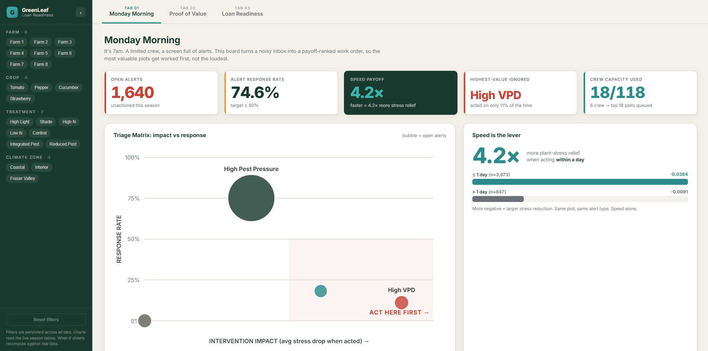

# GreenLeaf Lending Analytics

Interactive loan-readiness dashboard built for the RBC × BCCAI × SFU Beedie Agribusiness Analytics Hackathon. It turns a full season of greenhouse sensor data into a financing case a B.C. farmer can hand to an RBC credit officer.

## Demo

[](https://github.com/user-attachments/assets/d302b062-2bf6-46a1-8de8-c222809ae3d4)

*Click the thumbnail to watch the demo: live filtering, the Loan Readiness Score, the Banker/Farmer toggle, and the what-if slider crossing the approval band.*

## Get started

No build step, no dependencies — just serve the repo and open the dashboard:

```bash
git clone https://github.com/maximenewman/GreenLeaf-Lending-Analytics.git
cd GreenLeaf-Lending-Analytics
python -m http.server 8000
```

Then open [http://localhost:8000/dashboard/GreenLeaf%20Dashboard.html](http://localhost:8000/dashboard/GreenLeaf%20Dashboard.html) in your browser.

## The problem

GreenLeaf's sensors fired 6,460 alerts in one season. The crew acted on 4,820 and ignored 1,640. The ignored alerts were not noise: on average they were the most valuable ones in the dataset. The dashboard turns that buried fact into decisions.

## The three views

1. **Monday Morning** (operations): a payoff-ranked work order. Responding to an alert within a day relieves 4.2× more plant stress than waiting. A crew-size slider trims the queue to what a real team can clear.
2. **Proof of Value** (finance): isolates $47,034 of season benefit attributable to precision management, from just 4.6% of input spend, with the 6 zero-benefit plots named honestly.
3. **Loan Readiness** (the pitch): one 0-100 score built from profitability, alert responsiveness, precision ROI, and downside consistency. A what-if slider shows the score crossing the 75 approval band when alert response reaches 90%, worth about $9,700 per season. A toggle reframes the identical numbers for a banker (underwriting risk) or a farmer (a to-do list with payback).

## How it works

- **Data**: 120 plots across 8 farms, 25,200 daily sensor readings, per-plot cost and season-summary tables (Feb to Sep 2025). All figures are computed from the raw CSVs, not estimated.
- **Live aggregation**: every chart, KPI, and the loan score recompute in the browser when you filter by farm, crop, treatment, or climate zone (`selectors.js`).
- **Stack**: React 18 with in-browser Babel, hand-built SVG charts, no chart library, no build step. Open `dashboard/GreenLeaf Dashboard.html` in a browser and it runs.

## Repository layout

```
dashboard/
  GreenLeaf Dashboard.html   entry point
  app.jsx                    shell: sidebar filters, tabs
  selectors.js               live aggregation engine
  data.js                    plot-level dataset (generated from raw CSVs)
  charts.jsx, charts2.jsx    SVG chart primitives
  tab1.jsx, tab2.jsx, tab3.jsx
  styles.css
  thumnnail.png              demo thumbnail
  GreenLeaf Precision Agriculture Loan Readine 2026-07-05 19-22-21.mp4
```

## Methodology notes

- Precision benefit is the modeled gap between actual profit and a routine-only baseline, holding treatment, crop, and climate constant.
- The score uses the **median** return on precision spend (2.25×), not the mean (3.0×), which is inflated by one 15.6× outlier.
- Consistency penalizes only downside variance, the framing a credit committee expects.
